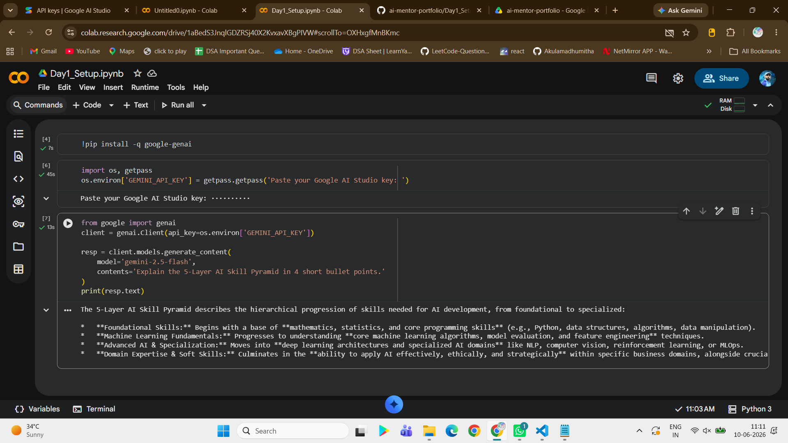
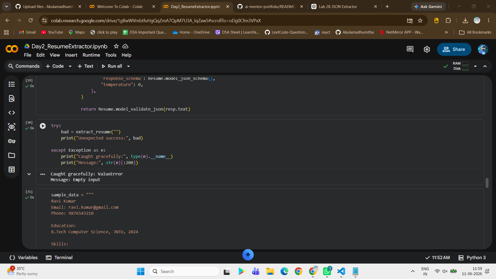

```markdown
# AI Mentor Bootcamp — Madhumitha Akula

Public portfolio of 12-day AI Trainer Workshop. By Day 12: 6 daily notebooks + capstone Streamlit URL.


## Day 1 — Setup complete

- ✅ Google AI Studio API key provisioned
- ✅ Groq API key provisioned
- ✅ Hello-Gemini call working — see [Day1_Setup.ipynb](Day1_Setup.ipynb)
- 4-tool comparison matrix from Lab 1A: see screenshot below



# Day 2 Lab 2B - JSON Resume Extractor

## Errors handled

1. Markdown fence wrapping
   Retry prompt requests raw JSON output.

2. Missing phone number
   Handled using Optional[str] = None.

3. Empty input
   Raises ValueError and is caught gracefully.

## Results

Resume 1: Ravi Kumar — 6 skills, 1.0 years exp

Resume 2: Sneha Reddy — 6 skills, 0.5 years exp

Resume 3: Arun Pillai — 9 skills, 1.0 years exp



```
